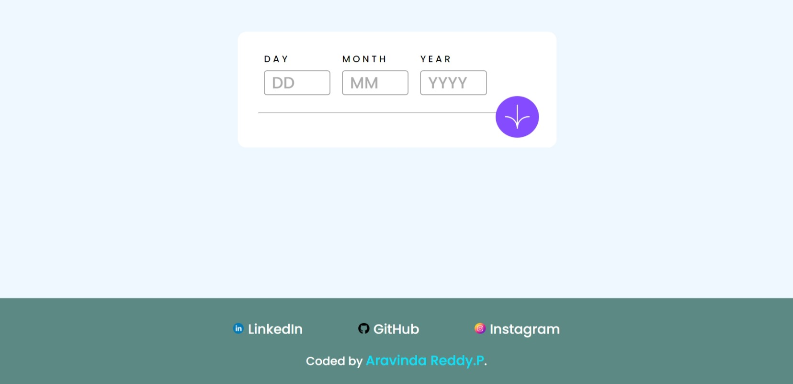
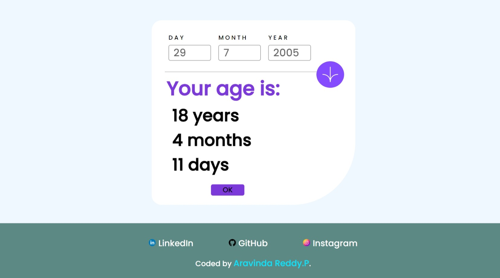

# Frontend Mentor - Age calculator app solution

This is a solution to the [Age calculator app challenge on Frontend Mentor](https://www.frontendmentor.io/challenges/age-calculator-app-dF9DFFpj-Q). Frontend Mentor challenges help you improve your coding skills by building realistic projects. 

## Table of contents

- [Overview](#overview)
  - [The challenge](#the-challenge)
  - [Screenshot](#screenshot)
  - [Links](#links)
- [My process](#my-process)
  - [Built with](#built-with)
  - [What I learned](#what-i-learned)
  - [Continued development](#continued-development)
  - [Useful resources](#useful-resources)
- [Author](#author)
- [Acknowledgments](#acknowledgments)

## Overview

### The challenge

Users should be able to:

- View an age in years, months, and days after submitting a valid date through the form
- Receive validation errors if:
  - Any field is empty when the form is submitted
  - The day number is not between 1-31
  - The month number is not between 1-12
  - The year is in the future
  - The date is invalid e.g. 31/04/1991 (there are 30 days in April)
- View the optimal layout for the interface depending on their device's screen size
- See hover and focus states for all interactive elements on the page
- **Bonus**: See the age numbers animate to their final number when the form is submitted

### Screenshot

![Desktop]

### Links

- Live Site URL: [Add live site URL here](https://putluruaravindareddy.github.io/beginner_projects/age_calculator/index.html)

## My process

### Built with

- Semantic HTML5 markup
- CSS custom properties
- Flexbox
- CSS Grid
- Mobile-first workflow
- [React](https://reactjs.org/) - JS library
- [Styled Components](https://styled-components.com/) - For styles

### What I learned

In this project, I have learned many things in JavaScript, including how to use the data given as input and how to convert that into our requirements. I have struggled to do responsive work, and I need to work on that in future projects.

### Continued development

Use this section to outline areas that you want to continue focusing on in future projects. These could be concepts you're still not completely comfortable with or techniques you found useful that you want to refine and perfect.

### Useful resources

- [Resource 1](https://developer.mozilla.org/en-US/) - This website helped me a lot in learning some new tags.
- [Resource 2](https://www.w3schools.com/) - This website helped a lot in learning JavaScript's unknown concepts.

## Author

- Website - [Aravinda Reddy.P]()
- Frontend Mentor - [@PutluruAravindaReddy](https://www.frontendmentor.io/profile/PutluruAravindaReddy)
- LinkedIn - [@ARAVINDA-REDDY](https://www.linkedin.com/in/aravinda-reddy-582364242)

## Acknowledgments

This project was built by myself without anyone's help.
